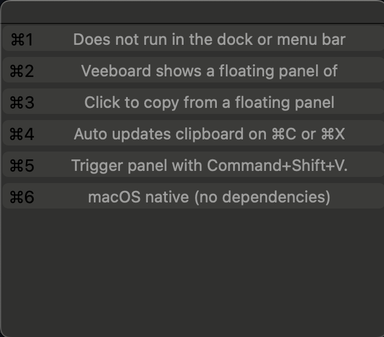

# veeboard
macOS Clipboard History like Windows 11 


**Veeboard** is a minimal clipboard history utility for macOS, inspired by Windows 11’s native clipboard history (Win+V). It tracks recent text copies (⌘C / ⌘X) and lets you quickly recall and reuse snippets via a small floating panel triggered by **Command+Shift+V**.

It’s lightweight, has no UI beyond the panel, and is built with Objective-C and Cocoa.

---



Veeboard shows a floating panel of your recent copied snippets (you click on an item and it copies, click anywhere else and it goes away, yaaaaaay!).


## Features

- Keeps a history of your last **5** plaintext snippets (configurable)
- Click to copy from a floating panel
- Auto updates clipboard on ⌘C or ⌘X
- Trigger panel with **Command+Shift+V**.
- Does not run in the dock or menu bar
- macOS native (no dependencies)

---

## Installation

### 1. Clone and build:

```bash
git clone https://github.com/MhrnMhrn/veeboard.git
cd veeboard
clang -framework Cocoa -framework ApplicationServices -o veeboard veeboard.m
```

### 2. Grant Accessibility access:

Open System Settings > Privacy & Security > Accessibility

Add the compiled veeboard binary to the list

### 3. Run:

```bash
./veeboard
```
You should see this log line:

```bash
veeboard started. Use Cmd-C/Cmd-X to record, Command+Shift+V to show.
```

## Usage

- ⌘C / ⌘X — adds copied plain text to history

- Command+Shift+V — shows the panel of recent snippets

- Click a row — restores the item to your clipboard and closes the panel

## Configuration

Edit these constants in the source:

```objc
static const int   kHistoryMax = 5;      // change to keep more snippets
static const float kPanelW     = 320.0;  // panel width
static const float kRowH       = 26.0;   // row height per entry
```

**The app does not store clipboard history to disk — everything is in memory only.**

## License

MIT License

## Credit
Made by Mehran Goudarzi and Mehrzad Sepahi, because macOS should have had this out of the box (jesuuuuus).
